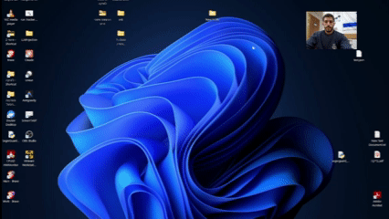
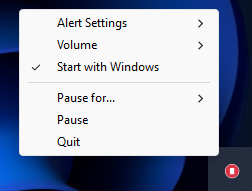

<h1 align="center">Stop Nail Biting</h1>

<p align="center">
  <strong>A lightweight app that spots nail-biting in real-time and makes you STOP.</strong>
</p>

<p align="center">
  
  
  
</p>

<p align="center">
  
</p>

---

## Quick Start

1. **Download** `StopNailBiting.exe` from [Releases](../../releases)
2. **Run** the executable
3. **Done** — look for the red icon in your system tray

---

## How It Works

The app runs silently in your system tray, monitoring your webcam. When it detects nail biting, it triggers an alert to make you stop.

By default, the alert is a flashing red screen and a BEEP noise, but you can configure either or both. Leaving both on is highly recommended!

**Detection pipeline:**
1. Detects hands in the webcam frame using MediaPipe
2. If hands are found, detects face and lip position
3. Checks if fingertips are inside the mouth region (2D + depth check)
4. Filters out false positives with temporal consistency (multiple frames required)
5. Optionally skips alert if drinking is detected (cup, bottle, or glass in frame)
6. Triggers alert (sound + visual flash) and pauses any playing media, resumes when it ends

---

## Features

| Feature | Description |
|---------|-------------|
| **Real-time Detection** | Uses MediaPipe hand and face tracking |
| **Dual Alert System** | Fullscreen red flash + audio alert (both configurable) |
| **Media Pause** | Automatically pauses Spotify, YouTube, VLC, etc. during alerts and resumes after |
| **Drinking Detection** | Reduces false positives by detecting cups, bottles, and glasses |
| **System Tray** | Runs quietly in the background |
| **Persistent Settings** | Preferences saved between sessions |
| **Volume Control** | Adjustable alert volume |
| **Auto-Start** | Optional launch on Windows startup |
| **Low Resource Usage** | Optimized to ~15 FPS with smart detection skipping |

---

## Installation

### Option 1: Download Executable (Recommended)

1. Go to [Releases](../../releases)
2. Download `StopNailBiting.exe`
3. Run — no installation required

### Option 2: Run from Source

```powershell
# Clone the repository
git clone https://github.com/orizaruk/stopnailbiting.git
cd stopnailbiting

# Create and activate virtual environment
python -m venv venv
.\venv\Scripts\Activate.ps1

# Install dependencies
pip install -r requirements.txt

# Run
python main.py
```

### Option 3: Build Executable

```powershell
# After completing Option 2 setup:
pyinstaller stopnailbiting.spec

# Output: dist/StopNailBiting.exe
```

---

## Usage

1. **Launch** — A red circle icon appears in your system tray
2. **Position webcam** — Ensure your face and hands are visible
3. **Work normally** — The app monitors in the background
4. **Get alerted** — When nail-biting is detected, you'll see/hear an alert
5. **Enable auto-start** — Check "Start with Windows" for automatic launch

### System Tray Menu

Right-click the tray icon to access settings:

<p align="center">
  
</p>

| Option | Description |
|--------|-------------|
| **Alert Settings** | |
| ├─ Enable Flash | Toggle fullscreen red flash |
| ├─ Enable Sound | Toggle audio alert |
| ├─ Pause Media on Alert | Auto-pause media players during alerts |
| └─ Drinking Detection | Skip alerts when holding a drink |
| **Volume** | Set alert volume (25%, 50%, 75%, 100%) |
| **Start with Windows** | Auto-launch on login |
| **Pause for...** | Pause detection for 30min, 1hr, or 2hrs |
| **Pause / Resume** | Toggle detection on/off |
| **Quit** | Exit the application |

### Tray Icon States

| Icon | Status |
|------|--------|
| Red circle | Actively monitoring |
| Gray circle | Paused |

---

## Configuration

Settings are saved to `%APPDATA%\StopNailBiting\config.json`:

```json
{
  "flash_enabled": true,
  "sound_enabled": true,
  "pause_media_on_alert": true,
  "drinking_detection_enabled": true,
  "start_with_windows": false,
  "volume": 0.75
}
```

### Custom Sound

Place a file named `noise` with a supported extension in the `assets/` folder:
- `noise.mp3`, `noise.wav`, or `noise.ogg`

The app auto-detects whichever format is present.

---

## Technical Details

### Dependencies

- [MediaPipe](https://mediapipe.dev/) — Hand and face landmark detection
- [OpenCV](https://opencv.org/) — Webcam capture
- [Shapely](https://shapely.readthedocs.io/) — Geometric polygon operations
- [Pygame](https://www.pygame.org/) — Audio playback
- [pystray](https://github.com/moses-palmer/pystray) — System tray integration
- [WinRT](https://pypi.org/project/winrt-Windows.Media.Control/) — Media playback control

### Detection Parameters

Adjustable in `main.py`:

```python
SENSITIVITY = 0.01        # Lip polygon buffer size
Z_DEPTH_THRESHOLD = 0.1   # Max z-difference for valid detection
FRAMES_REQUIRED = 3       # Consecutive frames before alert
TARGET_FPS = 15           # Frame rate cap
COOLDOWN_PERIOD = 1.5     # Seconds alert persists after detection stops
```

---

## Limitations

- Windows only
- Webcam cannot be shared with video conferencing apps (Zoom, Meet, etc.)
- First launch may be slow (~5-10s) while files extract

---

## Privacy

- **All processing is local** — No data leaves your computer
- **No recording** — Frames are processed in memory and immediately discarded
- **No network access** — Works entirely offline

---

## Contributing

Contributions are welcome! Feel free to submit a Pull Request.
